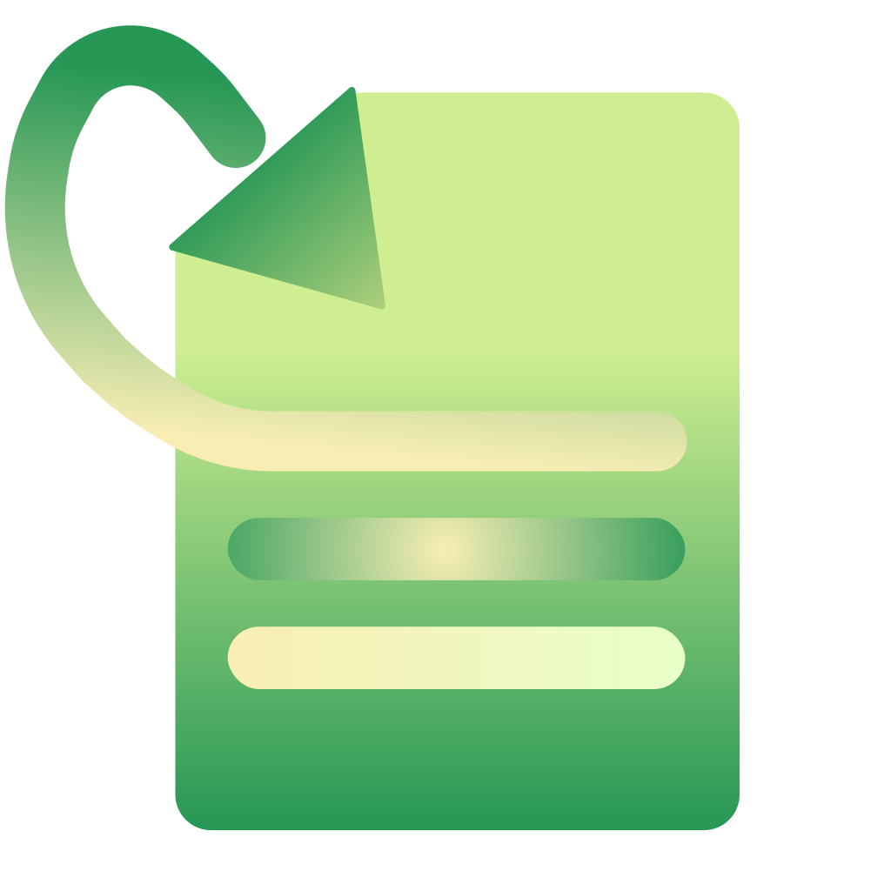
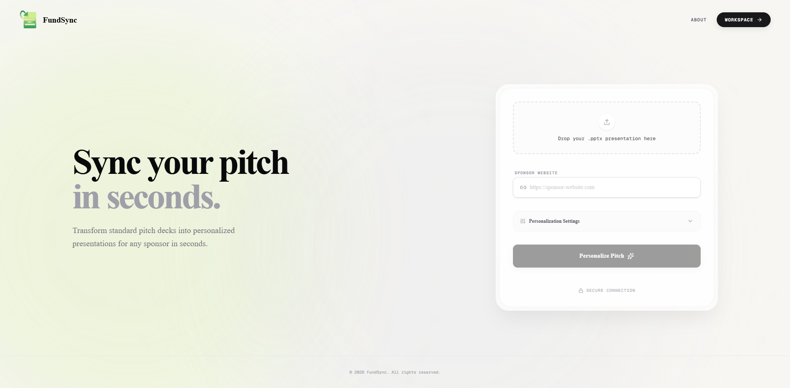
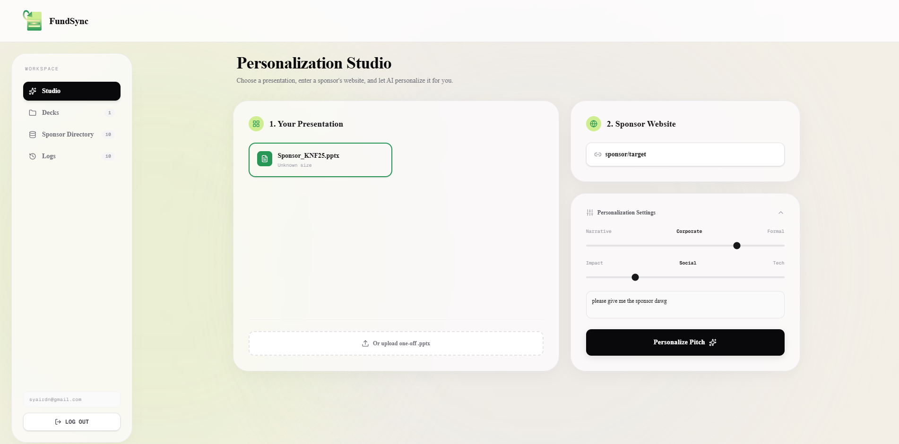

<div align="center">
  
  <h1>FundSync</h1>
  <p><strong>Stop rebuilding pitch decks. Just FundSync.</strong></p>
  <p>A high-agency, hyper-personalized automation tool for B2B sales and founders.</p>

  <p>
    <a href="https://github.com/szqiel/fundsync/blob/main/LICENSE">
      
    </a>
    
    
    
    
    
    
  </p>
</div>

---

## ⚡ The Alchemy Chamber

FundSync is not just a basic wrapper. It is a sophisticated, high-end automation layer designed to transform your "Master Deck" into a "Bespoke Pitch" in seconds. By deeply traversing `.pptx` XML and dynamically injecting scraped target data, it eliminates pre-pitch friction while keeping your styling perfectly intact.

<p align="center">
  
</p>

## ✨ Crafted for High-Stakes Pitches

Ditch the manual copy-pasting nightmare. FundSync is built around speed, aesthetics, and extreme personalization.

### 1. The Command Center (Dashboard)
Manage your pitch targets with a clean, deterministic interface. Input the target's URL, drop your `.pptx`, and let the agentic pipeline take over.

<p align="center">
  
</p>

### 2. Deep XML Traversal & AI Replacement
FundSync surgically targets text runs deep within the PowerPoint XML tree. Your custom fonts, hyperlinks, and slide designs remain completely untouched while the raw copy is rewritten by Google Gemini to perfectly align with your target's mission.

## 🎬 Core Features

- **⚡ Effortless Personalization** – Scrape any target sponsor's website using Firecrawl, automatically distilling their CSR or technical mandates into raw context for the AI.
- **⏱️ Asynchronous Parallel Processing** – The heavy Python backend processes AI scraping and file extraction simultaneously, cutting wait times in half.
- **👁️ Editorial Bento UI** – A pristine, "Cockpit meets Art Gallery" visual aesthetic featuring liquid glass refraction, Anthropic Beige (`#F3EFE7`), and Deep Primary Green (`#269755`).
- **📄 Perfect PPTX Exports** – Recompiles the modified XML back into a ready-to-present `.pptx` file. Your decks look identical to your master file, just uniquely tailored for the audience.
- **🔒 Secure Storage** – Private project protection and file storage backed by Supabase.

## 🛤️ Future Updates

- [ ] **Multi-Agent Workflow** – Simultaneous deployment of web-search agents for even deeper company research.
- [ ] **Automated Logo Replacement** – Swap placeholder logos with scraped company logos directly on the slides.
- [ ] **Batch Generation** – Upload a CSV of 50 target companies and generate 50 tailored decks overnight.

---

## 🛠️ Tech Stack & Architecture

FundSync employs a highly optimized **split-stack architecture** to prevent serverless timeouts during heavy AI workloads.

- **Frontend (Vercel):** Next.js 16 (App Router), React 19, Tailwind CSS 4, Framer Motion.
- **Backend (Hugging Face Spaces):** FastAPI, Python 3.12, `python-pptx`, Google Gemini, Firecrawl, CloudConvert.
- **Database & Auth:** Supabase (Postgres, Storage).

## 🚀 Local Development

Follow these steps to spin up the entire split-stack architecture locally:

### 1. Clone the repository
```bash
git clone https://github.com/szqiel/fundsync.git
cd fundsync
```

### 2. Backend Setup (FastAPI)
Navigate to the backend directory and install the Python dependencies.
```bash
cd backend
python -m venv venv
venv\Scripts\activate
pip install -r requirements.txt
```
Create a `.env` file in the `backend` folder:
```env
GEMINI_API_KEY=your_google_ai_key
FIRECRAWL_API_KEY=your_firecrawl_key
CLOUDCONVERT_API_KEY=your_cloudconvert_key
NEXT_PUBLIC_SUPABASE_URL=your_supabase_url
SUPABASE_SERVICE_ROLE_KEY=your_supabase_service_role_key
```
Launch the backend:
```bash
uvicorn main:app --reload
```

### 3. Frontend Setup (Next.js)
Open a new terminal and navigate to the frontend directory.
```bash
cd frontend
npm install
```
Create a `.env.local` file in the `frontend` folder:
```env
NEXT_PUBLIC_SUPABASE_URL=your_supabase_url
NEXT_PUBLIC_SUPABASE_ANON_KEY=your_supabase_anon_key
NEXT_PUBLIC_API_URL=http://localhost:8000
```
Launch the Next.js development server:
```bash
npm run dev
```

For full context on the design system and logic, refer to `CONTEXT.md` (if available locally).

## 📜 License

Distributed under the MIT License. See `LICENSE` for more information.

---

<div align="center">
  <p>Built for the next generation of founders by <a href="https://github.com/szqiel">szqiel</a></p>
</div>
